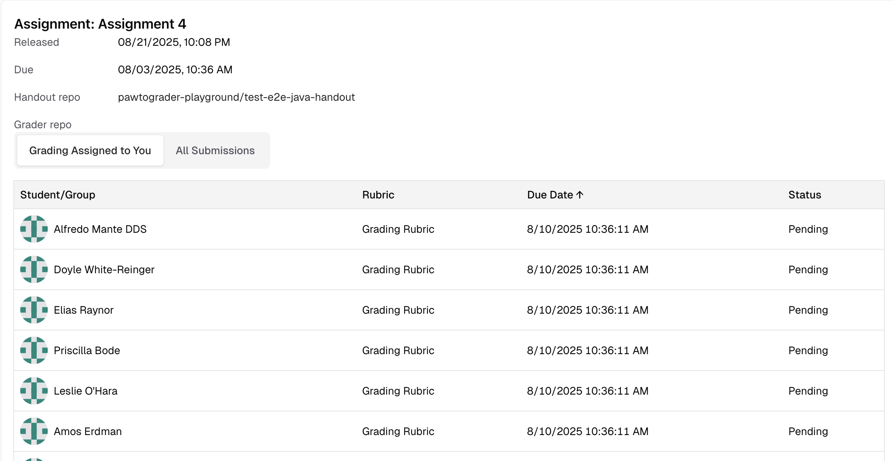
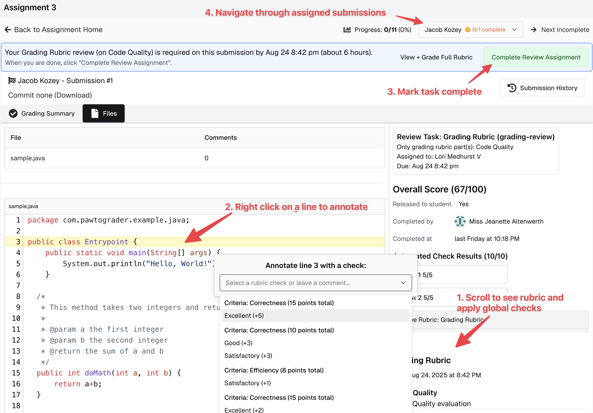
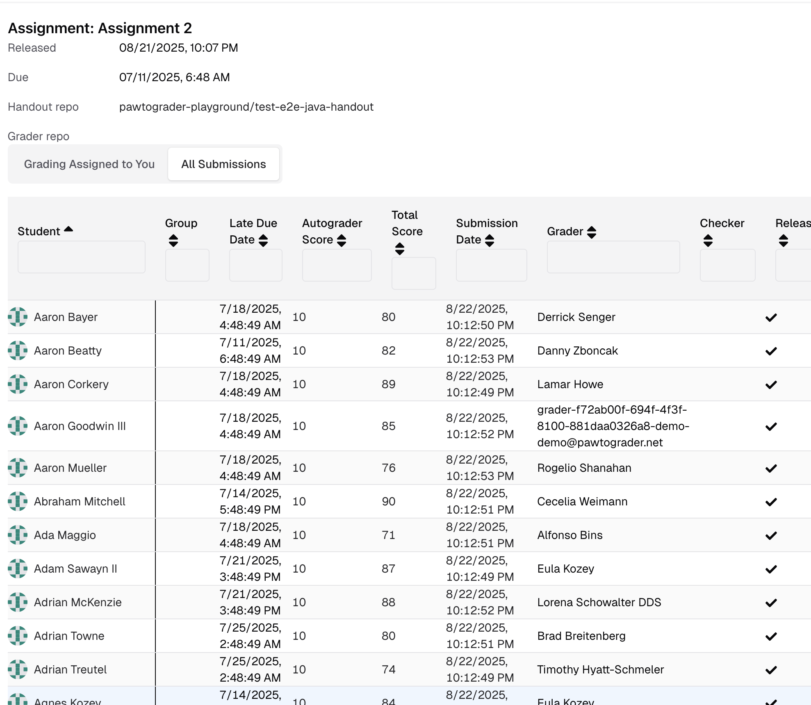
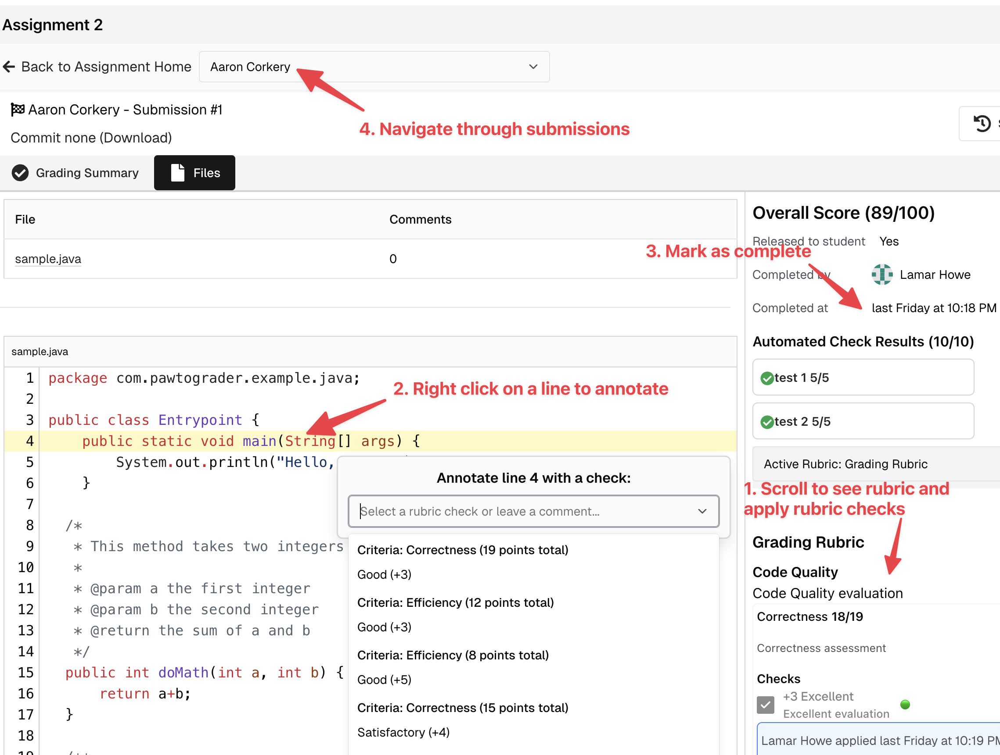

--- 
title: Handgrading 
sidebar_position: 4
---

Instructors can define multiple handgrading rubrics for each assignment, although the most typical mechanism is to simply use the "Grading Rubric" (which, combined with the autograder score, is used to compute the score for each submission).

Once all required rubric checks are done, the grader can click the "Complete Review" button to confirm that they have completed grading. This does **not** release the review to the student, but indicates to the instructor that it **could** be released (at the instructor's discretion).

## Grading submissions that you have been assigned
When you have submissions assigned to grade, you will see a summary of them on the assignment's landing page.

Click on any submission to view the grading interface. Click on the "Files" tab to view the submission's files.

Instructors can assign graders to entire submissions (grading the whole rubric on each submission), or can assign graders to only parts of each rubric for each submission. The grading interface will show you the rubric parts that you have been assigned to grade, and you can grade each part individually. If you are assigned to grade only a part of the rubric, you can also click on "View + Grade Full Rubric" to have access to grade the full rubric.

You can also grade the submission as a whole, by clicking on the "Grade" button.

## Grading submissions without assignments

If you have not been assigned to grade any submissions, you will see a list of all submissions on the assignment's landing page.

By clicking on a student/group name, you will be taken to the grading interface for that submission.

