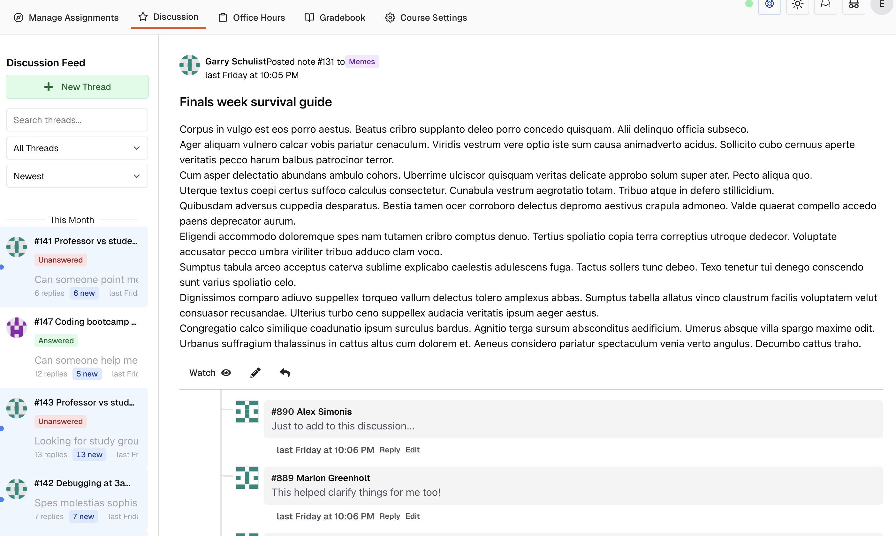

Pawtograder's discussion board feature allows students and staff to discuss course content and ask questions. It is **not** intended to be a replacement for office hours, although there is an option to format the post as a question that needs an answer (as opposed to a "note" that does not need an answer).

Posts can be shared with the entire class, or with course staff only. Each user in a class has a pseudonym, and can choose to use their real name or their pseudonym. Staff can always see the real name of a user.

Students can edit their own posts, and staff can edit any post.

By default, users do not get notifications for new posts, but can optionally "watch" a post to receive notifications when the post is updated or receives a new reply. Interacting with a post (e.g. replying to it) will automatically watch the post.