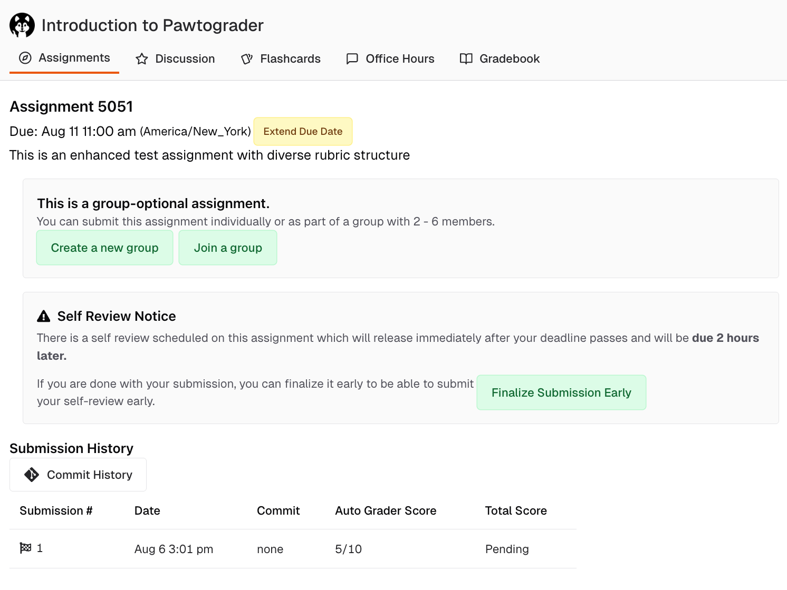
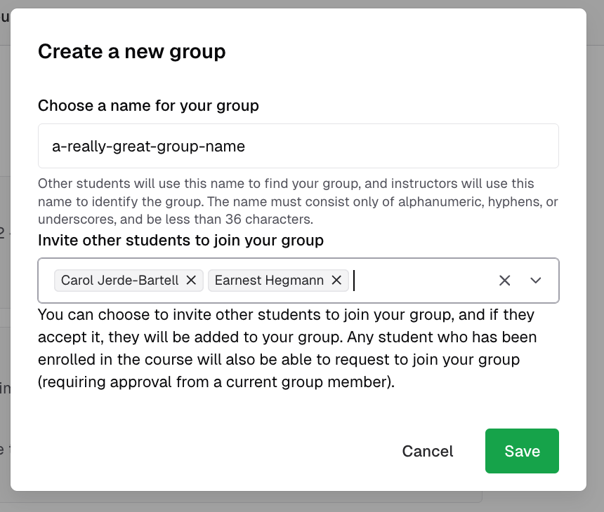
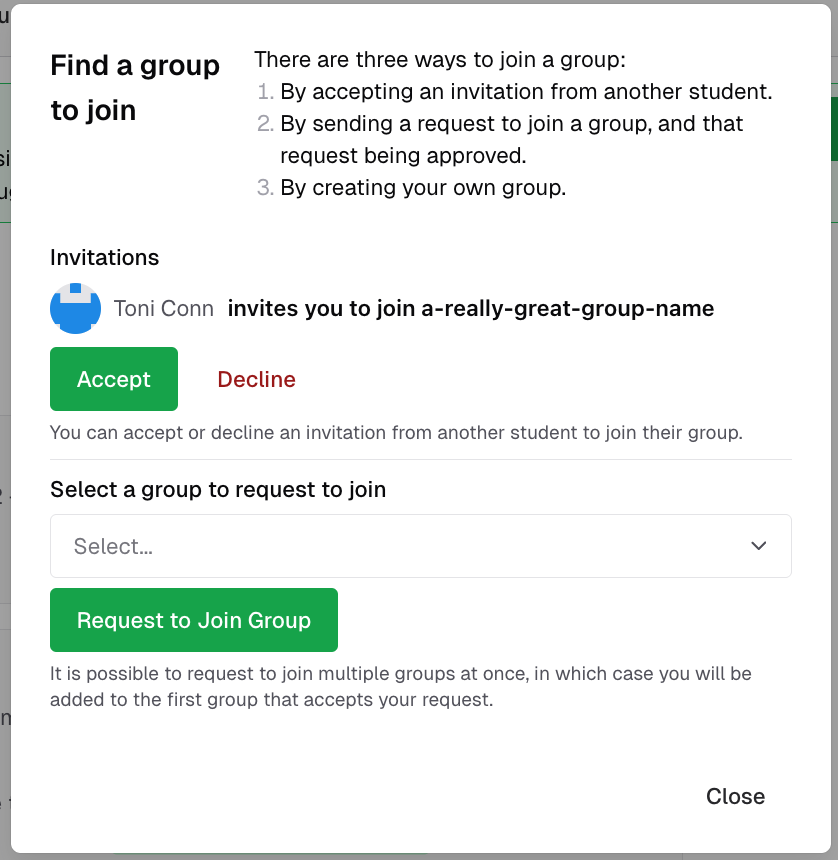

## Overview
Pawtograder supports two kinds of group assignments:
- Group optional: students can choose to work alone, or form a group.
- Group required: students must form a group.

When forming groups, instructors can choose to allow students to form groups themselves, or to form groups for them. This page provides instructions for students to form groups themselves.

Pawtograder uses an invitation system for group formation: students can create new groups, invite other students to join, and accept or reject invitations. Pawtograder automatically sends email invitaiton emails to students who are invited to join a group.

If group submissions are permitted, you will see a clear button to create a new group on the assignment page. If group submissions are optional, and you already have an individual submission, joining a group will automatically deactivate any existing submission or repository.

### Creating a New Group
Click "Create a new group" to create a new group. Pick a good name: other students will use this name to find your group, and instructors will use this name to identify the group. The name must consist only of alphanumeric, hyphens, or underscores, and be less than 36 characters.

Optionally, you can invite other students to join your group right as you create it. They will be notified by email, and can accept or reject the invitation.

After creating the group, you can still invite more students to it later.

### Managing Group Invitations
Once you are in a group, you will see a list of all the students in the group. You can invite more students to join the group or view the status of pending invitations by clicking "Invite other students".

### Joining a Group

To join a group or accept an invitation, click "Join a group" on the assignment page.

You can see any groups that you have been invited to and accept or decline the invitation. You can also select any other group that you would like to join to send a request (which must be approved by any existing group member).

