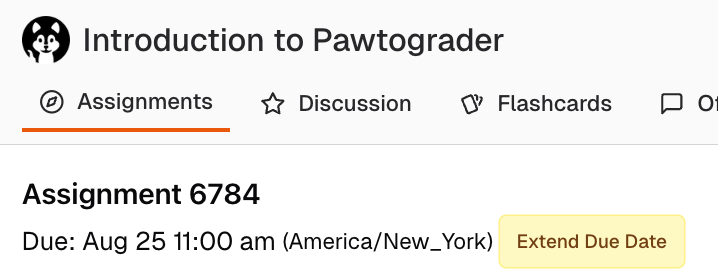
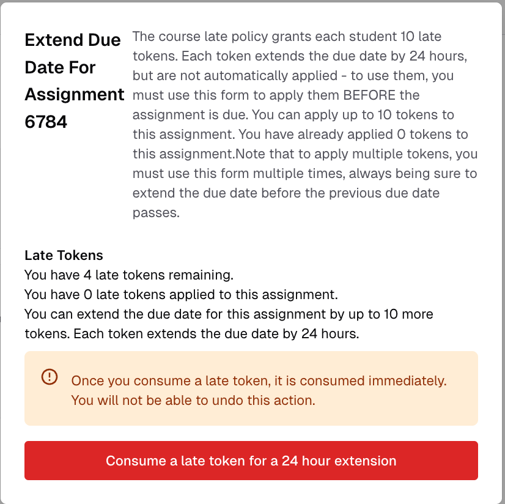
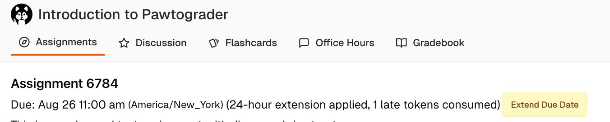

Pawtograder supports late submission policies based on "late tokens." Instructors determine how many late tokens are available to each student, and how many tokens can be used for each late submission. Each token extends the deadline by 24 hours, with no penalty. **Late tokens must be applied before the deadline.** If it is permitted to utilize multiple late tokens, you can apply them all at once, or one at a time, but must always apply them before the updated deadline.

On each assignment page where late tokens can be applied, you will see an "Extend Due Date" button next to your due date.

A confirmation dialog explains the course's policy (configured by your instructor).

After applying the token, you will see the new due date.

To use multiple late tokens, click the "Extend Due Date" button again.

### Late tokens and group assignments

The semantics of late tokens for group assignments are intended to be as straightforward and fair as possible:
- Any student in the group can apply a late token as long as they have one available (and the maximum number of tokens hasn't yet been applied to the assignment). It does not matter if a groupmate is out of tokens.
- All group members will have a token deducted from their total.
- All group members will see the same due date.