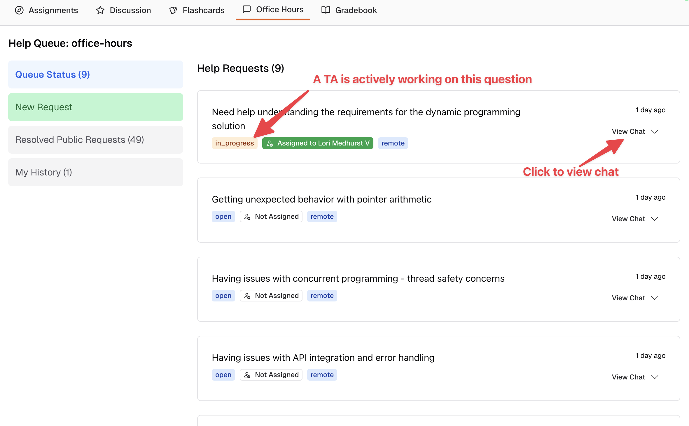
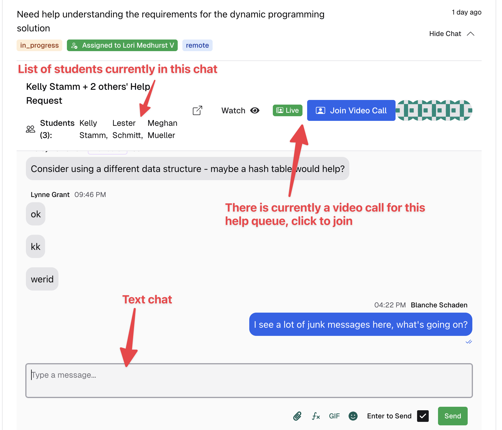
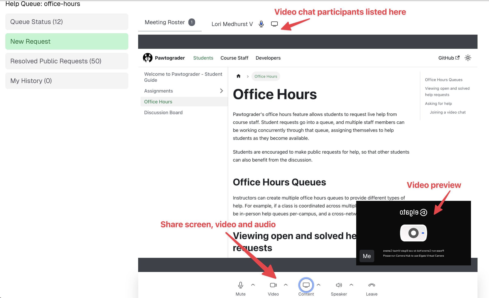
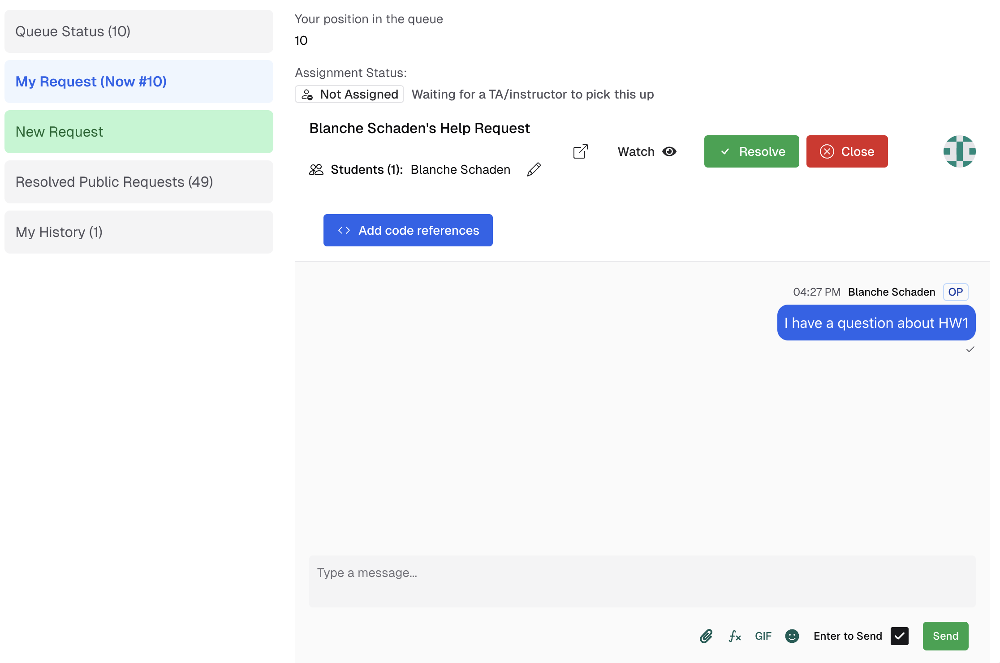

Pawtograder's office hours feature allows students to request live help from course staff. Student requests go into a queue, and multiple staff members can be working concurrently through that queue, assigning themselves to help students as they become available.

Students are encouraged to make public requests for help, so that other students can also benefit from the discussion.

## Office Hours Queues
Instructors can create multiple office hours queues to provide different types of help. For example, if a class is coordinated across multiple campuses, there may be in-person help queues per-campus, and a cross-network virtual help queue.

## Viewing open and solved help requests
Particularly when there are many students asking for help at once, it is likely that multiple students have a sufficiently similar question that they could both benefit from the same answer. If someone else already asked a question similar to yours, and you can see that they are about to be helped, you can join that discussion, rather than asking your own question at the end of the queue.

The "Queue Status" page shows the open help requests, and "Resolved Public Requests" shows those that have been resolved.

Click "View Chat" to see the discussion:

After a TA opens a video chat, students can click the "Join Video Chat" button to join the video chat. The video chat window will open in a popup.

## Asking for help
Students can ask for help by clicking the "New Request" button on the office hours queue page.

After opening the request, you will see your place in the queue.  
